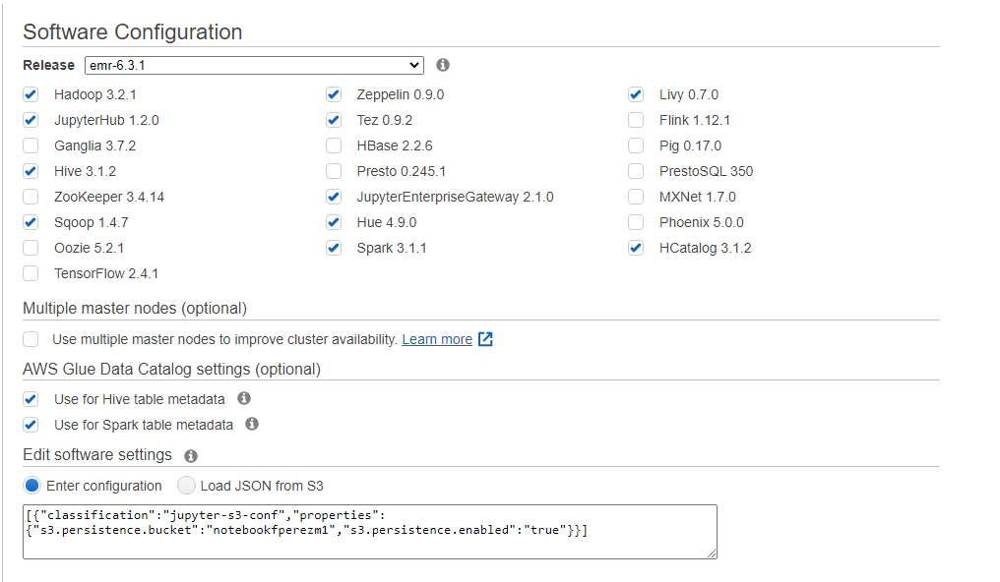
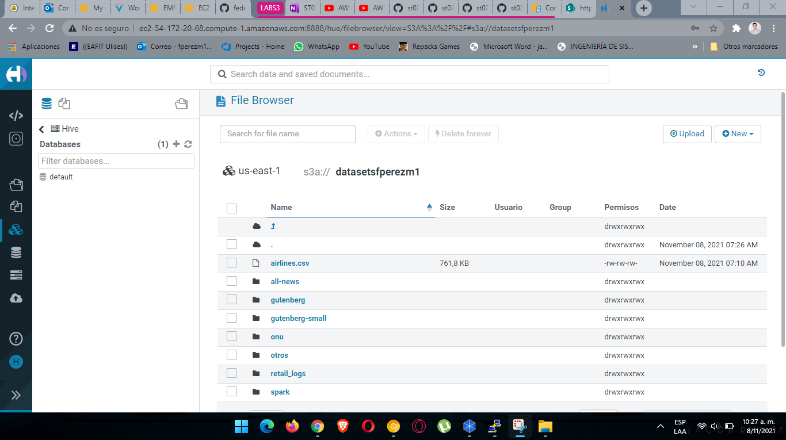

# Laboratorio 0

Carpeta del Laboratorio 0 para la materia Tópicos especiales en Telemática - ST0263
Universidad EAFIT

# Autor

+ Federico Pérez Morales
+ fperezm1@eafit.edu.co
+ 201810008010

# Pre-requisitos

+ Cuenta de AWS
+ EC2 key pair generada
+ Conexión a internet

# Descripcion

El desarrollo del presente laboratorio está enfocado a la aplicación de los conocimientos adquiridos sobre Big Data.
Para lograrlo debemos de seguir una serie de pasos y posteriormente ponerlo en práctica mediante el uso de clusters en AWS.

# Instalación

## Despliegue del proyecto en AWS

Para la implementación y el despliegue del laboratorio se siguieron los siguientes pasos:

### PARTE 1 - Creación del Cluster

+ Paso 1: Nos conectamos al curso en AWS educate.
+ Paso 2: Ingresar a la consola “AWS console”.
+ Paso 3: Nos dirigimos a la barra de busqueda y buscamos EMR.
+ Paso 4: Presionamos en donde dice “Create cluster”.
+ Paso 5: Se da click donde dice Go to advanced options.
+ Paso 6: Seleccionamos lo siguiente.

```
[{"classification":"jupyter-s3-conf","properties":{"s3.persistence.bucket":"notebookfperezm1","s3.persistence.enabled":"true"}}]
```
+ Paso 7: Presionamos Next o Continuar (dependiendo del idioma).
+ Paso 8: En Cluster Nodes and Isntances elegimos como tipo de instancia la m4.xlarge y ponemos la opción de compra como Spot.
+ Paso 9: Bajamos un poco mas y el EBS Root Volume lo ponemos de 20 GiB y que se auto termine en 1 hora.
+ Paso 10: Presionamos en “next”.
+ Paso 11: Ponemos un nombre al cluster.
+ Paso 12: Presionamos en “Create cluster” y esperamos aproximadamente 20 minutos.

### PARTE 2 - Tutorial para Windows con el fin de estabalecer Conexión SSH y conectarnos a la máquina virtual

+ Paso 1: Instalar Putty (<https://www.putty.org/>).
+ Paso 2: Abir putty.
    + Nos dirigmos a Connection, SSH, Auth, y cargamos la clave .ppk que transformó anteriormente.
    + Regresamos a sesión y en donde dice hostname colocamos ``` hadoop@"public dns de su cluster" ```. (sin los ")
    EJEMPLO:
    ```
    $ ec2-user@ec2-54-196-113-35.compute-1.amazonaws.com
    ```
    + Luego en saved session, colocamos un nombre para guardar la configuración (ejemplo: ProyectoTelematica) y luego de presionamos en “Save” para que la configuración quede guardada, y la próxima vez, solo sea cargarla.
    + Por ultimo de click en Open, y presionamos que sí en el aviso que sale.
    + Si todo salió bien, deberá ver una terminal y le dará si al aviso que sale.

### PARTE 3 - Realización de actividad HDFS

+ https://github.com/st0263eafit/st0263_20212/tree/main/bigdata/01-hdfs

+ Guttenberg-Small: https://datasetsfperezm1.s3.amazonaws.com/gutenberg-small/
+ Guttenberg: https://datasetsfperezm1.s3.amazonaws.com/gutenberg/gutenberg-txt-es.zip-url.txt

### Imagenes del desarrollo





# Referencias:
A continuación se encuentran las paginas de las cuales se investigó para desarrollar el laboratorio.

+ [How to Install RabbitMQ on CentOS 7](https://www.vultr.com/docs/how-to-install-rabbitmq-on-centos-7)
+ [Persistencia Amazon S3](https://docs.aws.amazon.com/emr/latest/ReleaseGuide/emr-jupyterhub-s3.html)
+ [Instalación y ejemplos de RabbitMQ Message Broker](https://programmerclick.com/article/8374663598/)
